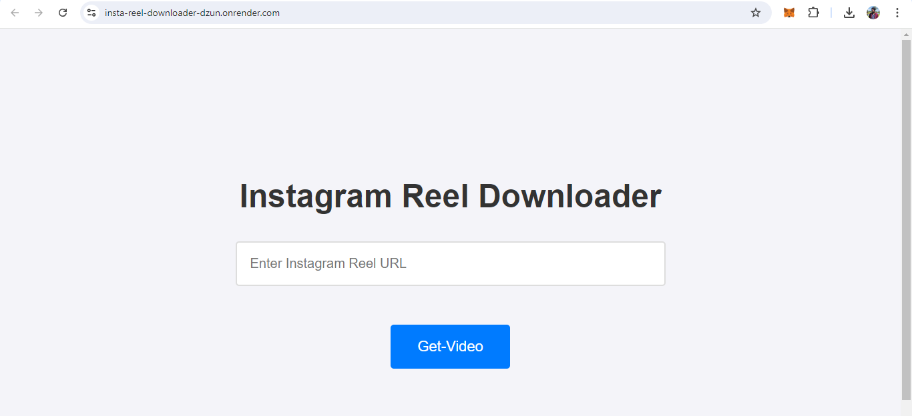

Instagram Video Downloader

Instagram Video Downloader is a web application that allows users to download Instagram reels directly by entering the URL. The application provides a simple interface where users can preview the video and download it instantly without any redirection.

Features

•Direct Download: Enter the Instagram reel URL and download the video directly without redirection.

•Custom Video Controls: Preview the video with custom play, pause, and volume controls before downloading.

•Responsive Design: Optimized for both PC and mobile devices, ensuring a smooth and consistent user experience 
across different screen sizes.

•Loading Indicator: A loading spinner is displayed while the video is being fetched, enhancing user experience.

Demo

Getting Started

Prerequisites

•[Node.js](https://nodejs.org/) (version 12.x or higher)

•[npm](https://www.npmjs.com/) (Node package manager)

Installation

Clone the repository:

git clone https://github.com/mujju834/Instagram-Video-Downloader.git

cd Instagram-Video-Downloader

Install the dependencies:

npm install

Create a `.env` file in the root directory and add your API key:

RAPIDAPI_KEY=your_rapidapi_key_here

Start the server:

npm start

Open your browser and go to:

http://localhost:5000

Usage

1.Enter the Instagram reel URL in the input box.

2.Click the **Download** button.

3.The video will be previewed on the page with custom controls for playing, pausing, and adjusting volume.

4.To download the video, click the **Download Video** button. The video will be downloaded directly.

Technologies Used

•HTML: For structuring the web page.

•CSS: For styling the user interface and ensuring responsiveness.

•JavaScript: For handling the frontend logic and user interactions.

•Node.js: For the backend server.

•Express.js: For routing and handling API requests.

•Fetch API: For making asynchronous requests to the backend server.

•RapidAPI: For accessing the Instagram scraping API.

Environment Variables

RAPIDAPI_KEY: Your RapidAPI key for accessing the Instagram scraping API.

Contributing

Contributions are welcome! Please fork this repository and submit a pull request for any features, improvements, or bug fixes.

License

This project is licensed under the MIT License - see the [LICENSE](LICENSE) file for details.

Contact

If you have any questions or feedback, please feel free to contact me:

GitHub:

[mujju834](https://github.com/mujju834)

Email: [mujjumazeme@gmail.com]( mujjumazeme@gmail.com)
